# Sentinel ML

> Fraud detection with real-time drift monitoring — IsolationForest + PSI + FastAPI + React

## What this is

Sentinel ML is an end-to-end machine learning pipeline that simulates how a fraud detection system behaves in production: raw credit-card transaction data is partitioned into weekly batches, an Isolation Forest is trained on the earliest window, and every subsequent batch is scored against the baseline using the Population Stability Index (PSI) to detect distributional drift before it silently degrades model performance. The system exposes this pipeline through a FastAPI backend with three endpoints — predict, drift, and retrain — and a React dashboard that makes drift immediately visible and one-click actionable.

---

## Architecture


---

## Project Structure

```
sentinelML/
├── data/
│   ├── creditcard.csv          # Source dataset (Kaggle ULB)
│   ├── batch_01.csv            # Training baseline (~47k rows each)
│   ├── batch_02.csv – 04.csv   # Training window
│   └── batch_05.csv – 06.csv   # Live drift windows
│
├── models/
│   └── isolation_forest_v1.joblib
│
├── scripts/
│   ├── split_data.py           # Partitions creditcard.csv → 6 batches
│   ├── train_model.py          # Fits IsolationForest, logs to registry.csv
│   └── detect_drift.py         # Standalone PSI check across all batches
│
├── api/
│   └── main.py                 # FastAPI — /predict /drift /retrain /health
│
├── frontend/
│   └── src/
│       ├── App.jsx
│       ├── components/
│       │   ├── PredictForm.jsx # Score a transaction live
│       │   ├── DriftMonitor.jsx# PSI bar chart + retrain trigger
│       │   └── ScoreChart.jsx  # PSI trend line across batches
│       └── style.css
│
├── sentinel.ipynb               # Training + PSI exploration notebook
├── registry.csv                 # Append-only training run log
└── requirements.txt
```

---

## Key Engineering Decisions

### PSI over simpler drift checks

The most common naive drift check is to compare means or standard deviations of the incoming feature distribution against the baseline. That approach misses shape changes: two distributions can share a mean and variance while being structurally different in ways that matter to a model. PSI — borrowed from credit risk modelling — operates on the full distribution by binning it into deciles and computing the KL-divergence-like sum `Σ (actual% − expected%) × ln(actual% / expected%)`. The thresholds (< 0.1: stable, 0.1–0.2: monitor, > 0.2: retrain) are industry-calibrated and give a single interpretable scalar per batch window rather than a per-feature p-value matrix that requires aggregation. Critically, PSI is computed on the **anomaly score** output of the model rather than raw features — this makes it model-aware: the same feature shift matters more if it changes what the model actually predicts.

### IsolationForest over a supervised classifier

The Kaggle credit card fraud dataset has a fraud rate of ~0.17%. Training a supervised classifier (logistic regression, XGBoost) directly on this would either require SMOTE/class weighting hacks that can introduce their own distributional artefacts, or would produce a model whose recall is heavily dependent on the specific class balance of the training slice. IsolationForest sidesteps the label problem entirely: it learns the structure of the majority class (normal transactions) and scores anomalies by how few splits are needed to isolate them. This maps naturally to the production problem — in a real fraud pipeline, labelled positives arrive with a significant delay (chargebacks, investigations), making unsupervised isolation the more operationally honest choice. The `contamination=0.0017` parameter anchors the decision threshold to the known fraud rate without requiring any positive examples at training time.

---

## API Reference

Base URL (local): `http://localhost:8000`  
Interactive docs: `http://localhost:8000/docs`

| Method | Endpoint   | Description |
|--------|------------|-------------|
| `POST` | `/predict` | Score a transaction. Body: `{ "features": { "Time": 0, "V1": ..., "Amount": 0 } }` |
| `GET`  | `/drift`   | PSI per batch window vs. Batch 01 baseline |
| `POST` | `/retrain` | Refit on latest batch, hot-swap model, log to `registry.csv` |
| `GET`  | `/health`  | Liveness + model-loaded status |

**Example — `/predict` response:**
```json
{
  "anomaly_score": 0.08341,
  "is_anomaly": false
}
```

**Example — `/drift` response:**
```json
[
  { "batch": 2, "batch_file": "batch_02.csv", "psi": 0.0396, "status": "Stable", "retrain_recommended": false },
  { "batch": 4, "batch_file": "batch_04.csv", "psi": 0.6024, "status": "DRIFT DETECTED", "retrain_recommended": true }
]
```

---

## PSI Results (Baseline: Batch 01)

| Batch | PSI    | Status           |
|-------|--------|------------------|
| 02    | 0.0396 | Stable           |
| 03    | 0.0506 | Stable           |
| 04    | 0.6024 | ⚠ DRIFT DETECTED |
| 05    | 0.7348 | ⚠ DRIFT DETECTED |
| 06    | 0.6697 | ⚠ DRIFT DETECTED |

Batches 4–6 represent the simulated "live" production window. PSI > 0.6 in all three signals a significant population shift from the training distribution, triggering the retrain flag.

---

## Initial Model Performance (Batch 01)

| Metric    | Score  |
|-----------|--------|
| Precision | 0.6420 |
| Recall    | 0.3562 |
| F1        | 0.4581 |

Recall is intentionally not maximised here — in the unsupervised setting, raising recall by lowering the anomaly threshold will flood operators with false positives, eroding trust in the system. Precision is the more operationally relevant metric for an alert that requires human review.

---

## Running Locally

**Prerequisites:** Python 3.11+, Node 18+

```bash
# 1. Clone and install Python dependencies
pip install -r requirements.txt

# 2. Split the dataset
python scripts/split_data.py

# 3. Train the model
python scripts/train_model.py

# 4. Start the API (from project root)
uvicorn api.main:app --reload --port 8000

# 5. Start the frontend (separate terminal)
cd frontend
npm install
npx vite          # → http://localhost:3000
```

---

## Frontend (Live)

**Deployed frontend:** `[YOUR_NETLIFY/VERCEL_LINK_HERE]`

> **Note:** The FastAPI backend is not hosted — it is designed to run locally against your own copy of the data and model. The live frontend link connects to `http://localhost:8000` by default; to use the deployed UI against your local API, ensure the backend is running and CORS is satisfied (already configured for `localhost:3000`).

---

## Dataset

[ULB Credit Card Fraud Detection](https://www.kaggle.com/datasets/mlg-ulb/creditcardfraud) — 284,807 transactions, 492 fraud cases (0.172%). Features V1–V28 are PCA-transformed; only `Time` and `Amount` are in the original space.

---

## Stack

| Layer     | Technology |
|-----------|------------|
| Data      | pandas, NumPy |
| Model     | scikit-learn IsolationForest |
| Serving   | FastAPI + Uvicorn |
| Frontend  | React + Vite + Recharts |
| Tracking  | `registry.csv` (append-only flat file) |
